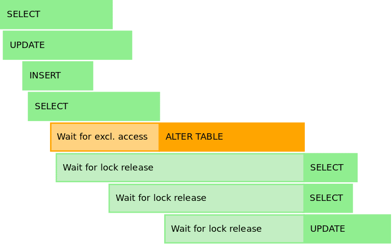
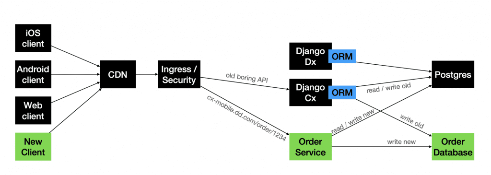
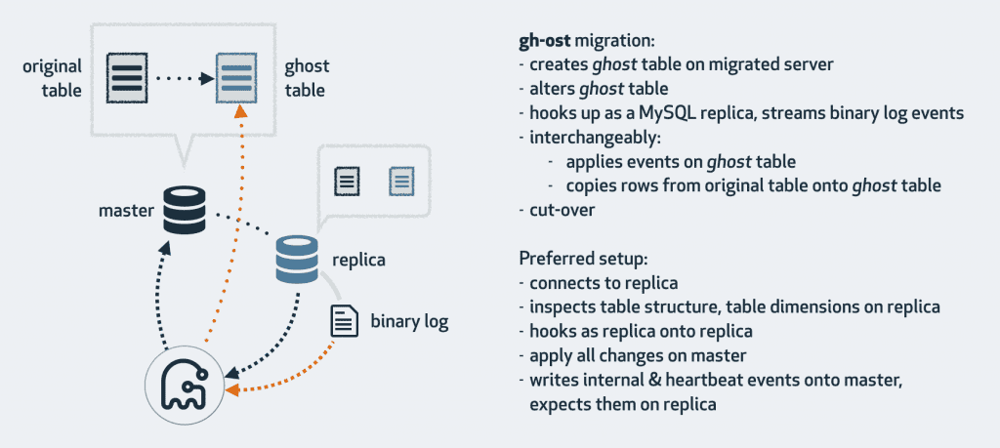

# Di chuyển cơ sở dữ liệu

Tôi coi việc di chuyển cơ sở dữ liệu là một trong những vấn đề khó chịu nhất phải giải quyết trong cuộc đời của một kỹ sư phần mềm. Không chỉ vậy, nếu nó gặp trục trặc, như thường lệ, mọi người có xu hướng nảy sinh lo lắng liên quan đến bất kỳ thay đổi lược đồ nào.

Vậy tại sao nó lại khó chịu đến vậy? Thoạt nhìn thì có vẻ đơn giản nhưng khi bắt đầu nghĩ về nó lại rất khó.

Khung lựa chọn chính của tôi là Django dựa trên Python, đã phát hành các di chuyển lược đồ hơn một thập kỷ trước và tôi vẫn coi đây là một trong những công cụ di chuyển tốt nhất mà tôi từng thấy. (và tôi đã làm việc với nhiều framework khác nhau trên nhiều ngôn ngữ).

Nhưng ngay cả với một khung tuyệt vời tự động tạo các tệp di chuyển, lưu trữ các tham chiếu di chuyển trong cơ sở dữ liệu và cho phép khôi phục dễ dàng — có rất nhiều điều cần cân nhắc khi bạn thực hiện di chuyển cơ sở dữ liệu.

Hãy tưởng tượng một cách tiếp cận mới để tách trường ‘name’ thành ‘first_name’ và ‘last_name’ trong Bảng người dùng. Mọi chuyện đang diễn ra tốt đẹp. Bạn thực hiện di chuyển lược đồ, chạy tập lệnh di chuyển để chia dữ liệu cũ thành hai trường và triển khai API mới nhất hoạt động với những thay đổi này. Tuy nhiên, có điều gì đó không ổn với các trường mới. Quá trình giám sát của bạn cho thấy nhiều người dùng duy nhất không lưu được do một số lỗi xác thực, ví dụ: không phải tất cả các ký tự đều được chấp nhận. Sự cố này được coi là nghiêm trọng nên bạn và nhóm quyết định khôi phục. Nghe có vẻ hay đấy. Bạn hoàn nguyên quá trình di chuyển lược đồ và hoàn nguyên ứng dụng về trạng thái trước đó, nhưng sau đó bạn nhận thấy rằng việc ghi đang diễn ra với các trường mới trong khoảng thời gian triển khai nhỏ đó và hiện tại một số người dùng bị thiếu dữ liệu trong trường tên, dẫn đến dữ liệu không nhất quán .

Và giờ đây, độ phức tạp tăng thêm với yêu cầu thực hiện tất cả những việc đó mà không có thời gian ngừng hoạt động.

    🏄 Ví dụ này chỉ mang tính giả thuyết, nhưng điều tôi muốn nói là việc di chuyển cơ sở dữ liệu là những vấn đề phức tạp cần được giải quyết bằng quy trình gồm nhiều bước. Tôi cũng có thể liên tưởng đến những người thực sự không muốn tiếp cận những vấn đề như vậy - đó là một quá trình tẻ nhạt khi bạn cần phải xác minh dữ liệu liên tục.

Vì vậy, tôi đã đề cập rằng việc di chuyển dữ liệu rất khó và không ai muốn làm việc với chúng, nhưng tại sao? Dưới đây là một vài lý do:

1. Khi phát triển một sản phẩm, bạn chỉ có thể thấy trước một vài tháng, có thể một năm, phần mềm sẽ phát triển như thế nào và bạn có thể chuẩn bị như thế nào cho điều đó. Một năm sau, [chủ sở hữu sản phẩm](https://vadimkravcenko.com/shorts/what-does-a-product-owner-do-all-day/) có thể đến gặp bạn và nói: “Được rồi, ứng dụng tài chính của chúng tôi không còn dựa trên giao dịch nữa; mọi thứ đều là đăng ký,” - rõ ràng là một quá trình di chuyển cơ sở dữ liệu khổng lồ để phù hợp với trường hợp (hoặc xây dựng các giải pháp thay thế).

1. Thực hiện di chuyển cũng giống như làm việc với dây dẫn trực tiếp. Bạn có một chiếc đèn mới cần treo trên trần nhà nhưng bạn đang làm việc đó mà không cần tắt điện. Tôi lấy chiếc Đèn làm ví dụ vì hôm qua tôi đã treo một chiếc nên nghĩ đến nó.

1. Mọi quá trình di chuyển mà bạn đang triển khai (và đúng vậy, bạn cần coi quá trình di chuyển là mã chứ không chỉ là thay đổi cơ sở dữ liệu) cần phải hoạt động với ba tình huống khác nhau:

    1. **Upgrading (Migrating up)** - tính năng mới được xây dựng, mô hình dữ liệ được thêm/thay đổi/xóa. Các phiên bản ứng dụng mới và cũ vẫn được kỳ vọng sẽ hoạt động như mong đợi.

    1. **Downgrading (Migrating down)** - đã xảy ra lỗi, dữ liệu không nhất quán - bạn cần có cách để quay lại trạng thái ổn định trước đó một cách có kiểm soát. Không phải với những thay đổi thủ công trong DB.

    1. **Everything in between** - có nghĩa là tất cả logic chuyển đổi dữ liệu cần được quan tâm. Mặc dù ngày nay, có nhiều cách để thực hiện chuyển đổi dữ liệu trong khoảng thời gian dài hơn bằng tính năng ghi kép hoặc khái niệm “bảng ma” với sự trợ giúp của thư viện gh-ost từ Github; chúng ta sẽ nói về điều này sau.

1. Việc di chuyển dữ liệu cũng gặp vấn đề vì đây thường không phải là công việc của một người. Sự thay đổi mô hình dữ liệu càng lớn thì càng có nhiều người tham gia. Tốt nhất là nên có những người khác nhau ở chế độ chờ khi triển khai, sẵn sàng tham gia KHI có sự cố xảy ra. Tôi viết khi nào vì rất có thể có điều gì đó sẽ không diễn ra như kế hoạch ở ít nhất một trong các bước.

## Triển khai đơn giản

 

Đây là cách tiếp cận đơn giản nhất mà bạn có thể thực hiện khi triển khai một tính năng mới có các thay đổi về cơ sở dữ liệu, nghĩa là nếu bạn đủ nhỏ và có thể cho phép mình có một vài giây ngừng hoạt động:

1. Đẩy mã của bạn tới Bitbucket/Github/Gitlab.

1. Triển khai được kích hoạt.

1. Các container docker mới được xây dựng

1. Di chuyển cơ sở dữ liệu và tất cả các tập lệnh liên quan đều được chạy

1. Các vùng chứa Docker được khởi động lại trên máy chủ

Tôi đã thấy rất nhiều người ghét cách tiếp cận đơn giản này, nhưng tôi phải nói rằng, nó ổn thôi. Việc triển khai không cần phải đau đầu cho đến khi bạn đạt đến mức không có thời gian ngừng hoạt động là điều quan trọng đối với doanh nghiệp.

Cách tiếp cận trên hoàn toàn hợp lệ nếu:

1. Bạn có một phiên bản ứng dụng duy nhất.

1. Bạn có thể cho phép mình có vài giây ngừng hoạt động.

1. Bạn đã thử nghiệm quá trình di chuyển theo giai đoạn.

Đây không phải là một cách tiếp cận hợp lệ nếu:

1. Bạn đang chạy nhiều phiên bản ứng dụng, điều này có thể dẫn đến tình trạng dồn đuổi quá trình di chuyển và trạng thái cơ sở dữ liệu không hợp lệ.

1. Bạn có nhiều dữ liệu và cần chuyển đổi dữ liệu — điều này sẽ chặn quá trình triển khai hoặc có thể hết thời gian chờ.

1. Thời gian ngừng hoạt động không phải là một lựa chọn.

Bây giờ chúng ta đã làm rõ cách tiếp cận đơn giản nhất để triển khai các thay đổi, hãy xem xét một số tình huống di chuyển khác nhau mà bạn sẽ phải giải quyết trong sự nghiệp [kỹ sư phần mềm](https://vadimkravcenko.com/shorts/habits-of-great-software-engineers/) của mình.

## Kịch bản

### Thêm một trường mới

Đây là [trường hợp dễ nhất](https://gist.github.com/majackson/493c3d6d4476914ca9da63f84247407b), vì việc thêm trường vào cơ sở dữ liệu về cơ bản là điều không thể thực hiện được xét từ góc độ ứng dụng của bạn và sẽ không ảnh hưởng đến logic hiện tại theo bất kỳ cách nào. Trường mới sẽ chỉ được truy cập và sử dụng khi ứng dụng mới được triển khai.

Sau khi thêm trường vào ORM của bạn, hãy tạo tập lệnh di chuyển không thể thay đổi. Kiểm tra tập lệnh này cục bộ để đảm bảo nó hoạt động như mong đợi. Di chuyển tiến và lùi cần được kiểm tra. Đừng quên thêm đồ đạc vào các bài kiểm tra cho dữ liệu mới của bạn.

Nếu trường mới không thể rỗng, hãy cung cấp giá trị mặc định. Điều này rất quan trọng để tránh các vấn đề xảy ra với các bản ghi hiện tại không có trường này. Nếu có liên quan đến logic, ví dụ: trường là tổng hợp của các trường khác — hãy thêm logic vào tập lệnh di chuyển. (Tôi đề cập bên dưới lý do tại sao khái niệm này chỉ hoạt động đối với cơ sở dữ liệu có dung lượng thấp ~ vài triệu hàng và sẽ không hoạt động đối với cơ sở dữ liệu lớn.)

Tập trung vào phương pháp triển khai 2 giai đoạn. Đầu tiên, triển khai các thay đổi cơ sở dữ liệu. Vì việc thêm trường mới sẽ không phá vỡ bất kỳ thay đổi nào trong ứng dụng của bạn nên thao tác này sẽ chạy trơn tru ngay cả với phiên bản hiện tại của ứng dụng. Sau khi bạn tin tưởng rằng quá trình di chuyển đã thành công và không gây ra bất kỳ sự cố nào, hãy triển khai các thay đổi của ứng dụng.

Sau khi triển khai (cũng như trước đó), hãy giám sát hiệu suất của ứng dụng và cơ sở dữ liệu. Hãy chú ý đến bất kỳ hành vi bất ngờ nào liên quan đến lĩnh vực mới của bạn.

Bây giờ, hãy quay lại các trường không thể rỗng có giá trị mặc định. Đây là lý do tại sao các giá trị mặc định có thể đặc biệt có vấn đề đối với các tập dữ liệu lớn:

1. Cập nhật ngay lập tức tất cả các hàng - sau khi bạn thêm một cột mới có giá trị mặc định, hầu hết các DB sẽ cần cập nhật mỗi hàng có giá trị đó. Với hàng tỷ hàng, việc đó có thể mất một lúc.

1. Cập nhật ngay lập tức tất cả các hàng - sau khi bạn thêm một cột mới có giá trị mặc định, hầu hết các DB sẽ cần cập nhật mỗi hàng có giá trị đó. Với hàng tỷ hàng, việc đó có thể mất một lúc.

1. 
    

## Xóa một trường

Bây giờ chúng ta đang đi sâu vào nội dung [phức tạp hơn một chút](https://gist.github.com/majackson/493c3d6d4476914ca9da63f84247407b#removing-fields-or-tables), vì bạn đang xóa nội dung nào đó đã được sử dụng trong ứng dụng, vì vậy cách tiếp cận ở đây hơi khác một chút.

Bước đầu tiên diễn ra rất lâu trước khi quá trình di chuyển cơ sở dữ liệu diễn ra. Đánh dấu/đánh dấu mã sử dụng “trường cần xóa”. Sau khi tất cả các vị trí được đánh dấu, hãy bắt đầu bằng việc loại bỏ dần việc sử dụng trường đó trong ứng dụng - trước tiên là loại bỏ nhận xét.

    🏄 (Optional) Before physically removing a field, consider if the data in that field might be needed in the future. If so, archive this data in a different location.

Nếu trong ví dụ đầu tiên, chúng tôi đã triển khai các thay đổi cơ sở dữ liệu trước thì trong trường hợp này, chúng tôi bắt đầu bằng cách triển khai các thay đổi ứng dụng không còn sử dụng trường nữa. Đảm bảo ứng dụng ổn định với việc sử dụng trường đã xóa được nhận xét. Sau đó, triển khai di chuyển cơ sở dữ liệu để loại bỏ trường này. Quy trình hai bước này đảm bảo không có nỗ lực truy cập vào trường sau khi trường bị xóa.

Trọng tâm của chúng tôi là tránh sự không nhất quán về dữ liệu bằng mọi giá, vì vậy nếu bạn triển khai các thay đổi ứng dụng và thấy trường vẫn được cập nhật — thì bạn đã bỏ lỡ điều gì đó.

## Thay đổi trường có kèm theo logic nghiệp vụ

Bây giờ chúng ta đang đi đến những điều tốt đẹp. Thay đổi một trường đan xen với logic nghiệp vụ là một trong những tình huống di chuyển phức tạp nhất. Các trường hợp tương tự bao gồm việc tách một trường từ một bảng thành nhiều trường trong một bảng mới và di chuyển toàn bộ dữ liệu sang một cơ sở dữ liệu khác. Tất cả những trường hợp này đều giống nhau về cách xử lý.

Đây có lẽ là những trường hợp mọi người cố gắng tránh và tìm cách giải quyết. Lý do là — tác động của những thay đổi đó có thể ảnh hưởng đến nhiều phần khác nhau (bạn chưa biết) của ứng dụng. Đó là lý do tại sao trường hợp này:

- nên được xử lý như một đội

- nên được xử lý bằng logic ghi kép

- nên được xử lý bằng cách triển khai theo nhiều giai đoạn (giúp mọi thứ luôn hoạt động mà không có sự mâu thuẫn về dữ liệu)

Trước khi thực hiện bất kỳ mã hóa nào - hãy hiểu toàn bộ phạm vi thay đổi. Xác định tất cả các đường dẫn đọc có liên quan trong ứng dụng và đánh dấu chúng là sắp không được dùng nữa.

> "Việc tái cấu trúc tất cả các đường dẫn mã nơi chúng tôi thay đổi đăng ký được cho là phần thách thức nhất trong quá trình di chuyển. Logic của Stripe để xử lý các hoạt động đăng ký (ví dụ: cập nhật, chia tỷ lệ, gia hạn) trải dài hàng nghìn dòng mã trên nhiều dịch vụ.
Chìa khóa để tái cấu trúc thành công sẽ là quy trình tăng dần của chúng tôi: chúng tôi sẽ tách càng nhiều đường dẫn mã vào đơn vị nhỏ nhất càng tốt để chúng tôi có thể áp dụng từng thay đổi một cách cẩn thận.
Hai bảng của chúng tôi cần nhất quán với nhau ở mọi bước. Đối với mỗi đường dẫn mã, chúng tôi sẽ cần sử dụng một phương pháp tiếp cận tổng thể để đảm bảo các thay đổi của chúng tôi được an toàn. Chúng ta không thể chỉ thay thế các bản ghi mới bằng các bản ghi cũ: mọi logic cần phải được xem xét cẩn thận."

Như bạn có thể thấy từ ví dụ về Stripe, rất nhiều bước chuẩn bị diễn ra trước khi quá trình di chuyển bắt đầu. Các đường dẫn mã được xác định và tái cấu trúc để hỗ trợ ghi/đọc kép.

Ý nghĩa của việc di chuyển ghi kép về cơ bản có thể được chia thành các bước sau:

1. Thêm trường mới vào cơ sở dữ liệu (Không ảnh hưởng đến mã đang chạy).

1. Triển khai mã ứng dụng mới, được cấu trúc lại, nơi bạn bắt đầu ghi vào cả trường cũ và trường mới, áp dụng logic nghiệp vụ mới tương ứng. Việc đọc vẫn được thực hiện từ con đường cũ. Việc ghi vào cả hai trường **phải** diễn ra như một phần của một Giao dịch.

1. So sánh dữ liệu và đảm bảo nó nhất quán.

1. Viết mã di chuyển để chuyển đổi phần còn lại của dữ liệu từ trường cũ sang trường mới theo đúng định dạng. (Hoặc sử dụng gh-ost từ Github)

1. Triển khai quá trình di chuyển và thay đổi đường dẫn đọc sang trường mới. Đường dẫn ghi vẫn đến cả hai trường.

1. Xác minh ứng dụng và tính nhất quán của dữ liệu.

1. Xóa văn bản vào trường cũ. Tại thời điểm này, việc đọc/ghi chỉ diễn ra trong lĩnh vực mới. Trường cũ vẫn tồn tại trong cơ sở dữ liệu nhưng sẽ không được ghi.

1. Xác minh ứng dụng và tính nhất quán của dữ liệu.

1. Xóa mọi mã liên quan đến trường cũ.

1. Xác minh ứng dụng và tính nhất quán của dữ liệu.

1. Triển khai tập lệnh di chuyển để loại bỏ cột khỏi cơ sở dữ liệu.

1.Bắt tay với đồng đội của bạn.

Tôi hy vọng phần phân tích chi tiết này sẽ giúp bạn hình dung được quy trình thực hiện các thay đổi cơ sở dữ liệu phức tạp. Mỗi bước có thể được khôi phục riêng lẻ, mang lại sự ổn định cao hơn so với việc thực hiện tất cả các thay đổi cùng một lúc. Cách tiếp cận này không chỉ làm giảm khả năng xảy ra lỗi mà còn đảm bảo rằng nếu xảy ra lỗi, chúng có thể được sửa chữa mà không gây mất mát hoặc mâu thuẫn dữ liệu.

## Ứng dụng di động + di chuyển cơ sở dữ liệu

Trong khi nghiên cứu chủ đề này, tôi tình cờ nghe được một cuộc nói chuyện về cách [DoorDash chia cơ sở dữ liệu Postgres](https://yowcon.com/sydney-2022/sessions/2373/migrations-the-hardest-actual-problem-in-computer-science) của họ thành nhiều cơ sở dữ liệu nhỏ hơn và họ đề xuất một cách tiếp cận khác (Một biến thể của cách viết kép)

Vì DoorDash là một ứng dụng di động nên các phiên bản cũ của ứng dụng vẫn được sử dụng khi họ phát hành phiên bản mới. Do đó, việc di chuyển cơ sở dữ liệu trở thành một vấn đề lớn vì bạn phải tương thích ngược với dữ liệu đến từ nhiều phiên bản ứng dụng cũ hơn.

Họ đã thử các phiên bản khác nhau của tính năng ghi kép và cách tiếp cận thứ ba đáng ngạc nhiên:

1. Ghi kép dựa trên API - Trình bao bọc API xung quanh Dịch vụ cũ và Dịch vụ mới

1. Ghi kép dựa trên cơ sở dữ liệu - Cùng một API, nhưng ghi/đọc được kích hoạt cho hai cơ sở dữ liệu khác nhau

1. Phiên bản ứng dụng mới + Điểm cuối mới + Cơ sở dữ liệu mới - Phiên bản ứng dụng mới với điểm cuối khác đọc/ghi vào các cơ sở dữ liệu khác nhau dựa trên logic cũ/mới. Đây có thể được gọi là Ghi kép cấp ứng dụng, vì phiên bản ứng dụng mới xác định dữ liệu cũ/mới sẽ đi đến đâu.

Tôi thấy thật thú vị khi các công ty khác thực hiện những thay đổi cơ sở dữ liệu phức tạp, vì vậy tôi thực sự khuyên bạn nên đọc thêm một số bài viết về chủ đề này:

1. Trường hợp sọc: [Di chuyển đăng ký](https://stripe.com/blog/online-migrations)

1. Trường hợp Facebook: [Di chuyển Messenger](https://engineering.fb.com/2018/06/26/core-infra/migrating-messenger-storage-to-optimize-performance/)

1. Trường hợp Gusto: [Miễn trừ di chuyển](https://engineering.gusto.com/old-write/)

1. Hộp đựng: [Chuyển từ HBase sang Google BigTable](https://medium.com/box-tech-blog/zero-downtime-migration-from-hbase-to-bigtable-4f00f835755f)

## Không có thời gian chết

Hãy nói nhiều hơn về thời gian ngừng hoạt động bằng không.

Không phải tất cả các ứng dụng, đặc biệt là những ứng dụng phục vụ đối tượng toàn cầu, đều có thời gian bảo trì sang trọng. Đối với các nền tảng toàn cầu như Google, Facebook, LinkedIn và Netflix, không có thời gian "ngoài giờ cao điểm". Mặt trời không bao giờ lặn đối với cơ sở người dùng của họ, khiến bất kỳ thời gian ngừng hoạt động nào đều gây bất lợi cho trải nghiệm và doanh thu của người dùng. Nếu một trong số này bị hỏng - đó thường là câu chuyện số 1 trên HackerNews.

Đôi khi tôi ngạc nhiên khi nhận được email từ các nhà cung cấp cổng thanh toán cho biết họ sẽ có thời gian bảo trì vào tuần tới. Về cơ bản, điều đó có nghĩa là bạn sẽ không nhận được tiền trong thời gian này… xin lỗi vì điều đó.

Tôi đang cố gắng nói rằng bạn càng lớn thì dịch vụ của bạn càng trở nên quan trọng trong kinh doanh và bạn càng nhận được ít thời gian bảo trì hơn. Nếu không có thời gian bảo trì - không có thời gian ngừng hoạt động là cách duy nhất. Có, chúng thường mất nhiều thời gian hơn vì chúng được triển khai theo nhiều giai đoạn để đảm bảo rằng dịch vụ không bị gián đoạn ở bất kỳ thời điểm nào. Tuy nhiên, cách tiếp cận theo từng giai đoạn này, mặc dù tốn nhiều thời gian, nhưng lại là sự đánh đổi cần thiết để đảm bảo tính liên tục của dịch vụ và quan trọng hơn là tính nhất quán của dữ liệu.

Tuy nhiên, không phải tất cả các dịch vụ đều quan trọng đối với hoạt động kinh doanh và lý do chính dẫn đến thời gian ngừng hoạt động đối với các công ty không thuộc cấp Google là do không duy trì được khả năng tương thích ngược của mã với những thay đổi mới và quá trình di chuyển cơ sở dữ liệu kéo dài của họ.

Nếu bạn không có nhóm SRE lớn để giúp bạn triển khai, tôi khuyên bạn nên làm cho cuộc sống của mình tốt hơn một chút bằng một số công cụ cho phép thay đổi lược đồ tức thời, không bị chặn cũng như các bảng ma để di chuyển dữ liệu:

1. nếu bạn đang sử dụng MySQL - hãy cân nhắc sử dụng [gh-ost](https://github.com/github/gh-ost) bất khả tri của khung từ Github hoặc [MySQL Online DDL](https://dev.mysql.com/doc/refman/8.0/en/innodb-online-ddl.html) hoặc [pt-online-schema-change](https://docs.percona.com/percona-toolkit/pt-online-schema-change.html) hoặc Facebook [OnlineSchemaChange](https://github.com/facebookincubator/OnlineSchemaChange) hoạt động theo [cách tương tự](https://github.com/facebookincubator/OnlineSchemaChange/wiki/How-OSC-works) như gh-ost.

1. nếu bạn đang sử dụng Postgres và đang sử dụng Django - hãy thử [django-pg-zero-downtime-migrations](https://github.com/tbicr/django-pg-zero-downtime-migrations) hoặc Yandex [zero-downtime-migrations](https://github.com/yandex/zero-downtime-migrations), đây cũng là [một số nhận xét của HN về thư viện](https://news.ycombinator.com/item?id=18281639).

1. Ngoài ra còn có [SchemaHero](https://github.com/schemahero/schemahero) — một công cụ di chuyển lược đồ cơ sở dữ liệu nguồn mở giúp chuyển đổi định nghĩa lược đồ thành các tập lệnh di chuyển có thể áp dụng trong mọi môi trường.

## Phần kết luận

Hãy kết thúc bài viết bằng một số phương pháp hay nhất:

1. Không có thay đổi cơ sở dữ liệu thủ công. Luôn tạo các tập lệnh di chuyển bất biến.

1. Phiên bản cơ sở dữ liệu phải được chứa trong chính cơ sở dữ liệu đó. (Django thực hiện việc này một cách tự động)

1. Nếu bạn không có cửa sổ bảo trì - hãy tập trung vào quy trình ghi kép.

1. Khi xây dựng các tính năng có những thay đổi quan trọng về cơ sở dữ liệu - hãy nghĩ đến khả năng tương thích ngược và [sửa lỗi trừu tượng](https://files.gotocon.com/uploads/slides/conference_60/2373/original/Yow%202022%20-%20Migrations.pdf).

1. Hãy cân nhắc việc sử dụng các công cụ mới nhất để giúp quá trình di chuyển của bạn trở nên dễ dàng hơn.

1. Còn gì nữa? Đề xuất một số trong các ý kiến ​​:)